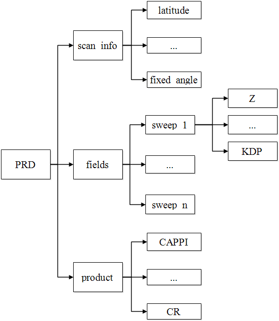
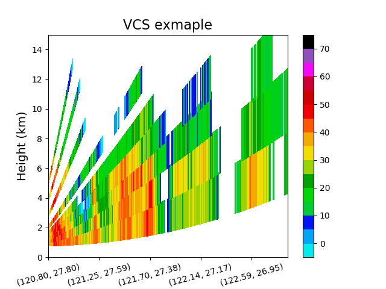

# 中国天气雷达开源库

- [English](README.md)
- [开发人员](CONTRIBUTORS.txt)

安装pycwr库
----------
### 可以使用conda和pip来安装pycwr库

如果你没安装 cartopy, 推荐使用conda来安装cartopy:

```
conda install -c conda-forge cartopy
```
然后, 可以使用以下pip命令安装:
```
pip install pycwr
```

### 当然你也可以通过源码安装:

```
git clone https://github.com/YvZheng/pycwr.git
cd pycwr
python setup.py install    
```

读取雷达数据 PRD类或者Py-ART的Radar类
----------
```
from pycwr.io import read_auto
file = r"./Z_RADR_I_Z9898_20190828192401_O_DOR_SAD_CAP_FMT.bin.bz2"
PRD = read_auto(file)
PyartRadar = PRD.ToPyartRadar()
```
PRD类的数据结构如下:



可视化PPI图像并叠加地图
----------
```
import matplotlib.pyplot as plt
import cartopy.crs as ccrs
from pycwr.draw.RadarPlot import Graph, GraphMap
ax = plt.axes(projection=ccrs.PlateCarree())
graph = GraphMap(PRD, ccrs.PlateCarree())
graph.plot_ppi_map(ax, 0, "dBZ", cmap="pyart_NWSRef")
ax.set_title("example of PPI with map", fontsize=16)
plt.show()
```


可视化PPI图像
----------
```
fig, ax = plt.subplots()
graph = Graph(PRD)
graph.plot_ppi(ax, 0, "dBZ", cmap="pyart_NWSRef")
graph.add_rings(ax, [0, 50, 100, 150, 200, 250, 300])
ax.set_title("example of PPI", fontsize=16)
ax.set_xlabel("Distance From Radar In East (km)", fontsize=14)
ax.set_ylabel("Distance From Radar In North (km)", fontsize=14)
```


根据起始点经纬度画垂直剖面
----------
```
fig, ax = plt.subplots()
graph = GraphMap(PRD, ccrs.PlateCarree())
graph.plot_vcs_map(ax, (120.8, 27.8), (122.9, 26.8), "dBZ", cmap="pyart_NWSRef")
ax.set_ylim([0,15])
ax.set_ylabel("Height (km)", fontsize=14)
ax.set_xlabel("Latitude, Longitude", fontsize=14)
ax.set_title("VCS exmaple", fontsize=16)
plt.show()
```



根据起始点笛卡尔坐标画垂直剖面
----------
```
fig, ax = plt.subplots()
graph = Graph(PRD)
graph.plot_vcs(ax, (0,0), (150, 0), "dBZ", cmap="pyart_NWSRef")
ax.set_ylim([0,15])
ax.set_ylabel("Height (km)", fontsize=14)
ax.set_xlabel("Distance From Section Start (Uints:km)", fontsize=14)
ax.set_title("VCS exmaple", fontsize=16)
plt.show()
```


启动图形化界面
----------

```
 python scripts/LaunchGUI.py
```

主窗口如下图所示:


更多个例参见[pycwr例子](./notebooks/pycwr_example.ipynb)

开发者
----------

郑玉 - 南京信息工程大学, 大气物理学院

李南 - 南京信息工程大学, 大气物理学院

魏鸣 - 南京信息工程大学, 大气物理学院

楚志刚 - 南京信息工程大学, 大气物理学院

樊丝慧 - 南京信息工程大学, 大气物理学院

贾鹏程 - 南京信息工程大学, 大气物理学院

李扬 - 南京信息工程大学, 大气物理学院

张昕 - 南京信息工程大学, 大气物理学院

吕星超 - 南京信息工程大学, 大气物理学院

张帅 - 南京信息工程大学, 大气物理学院

项目开发计划
----------

- [x] 国内WSR98D, CINRAD/SA/SB/CB, CINRAD/CC/CCJ, CINRAD/SC/CD支持
- [ ] Cfradial读取支持
- [x] 读取的同时计算经纬度
- [ ] PRD数据结构优化, 增加订正结果和反演结果的结构
- [ ] 绘图增加fig, ax的传入部分
- [x] NuistRadar类导出为Cfradial格式支持
- [x] 自动识别雷达站点并获取经纬度信息(针对SA/SB/CB)
- [x] 自动识别雷达数据格式类型
- [x] 转换为Pyart Radar类
- [x] 图形化界面支持
- [x] 垂直剖面支持
- [x] 雷达插值算法支持
- [x] PPI绘图支持, 叠加地图支持
- [ ] RHI绘图支持
- [ ] 多雷达反演算法支持
- [ ] 雷达数据产品生成算法支持
- [ ] 多普勒雷达/双偏振雷达质控算法
- [ ] 双偏振雷达雨滴谱反演算法支持
- [ ] 多普勒雷达风场反演支持
- [ ] 雷达定量估测降水算法支持
- [ ] 雷达回波外推算法支持
- [ ] 雷达定量预报降水算法支持